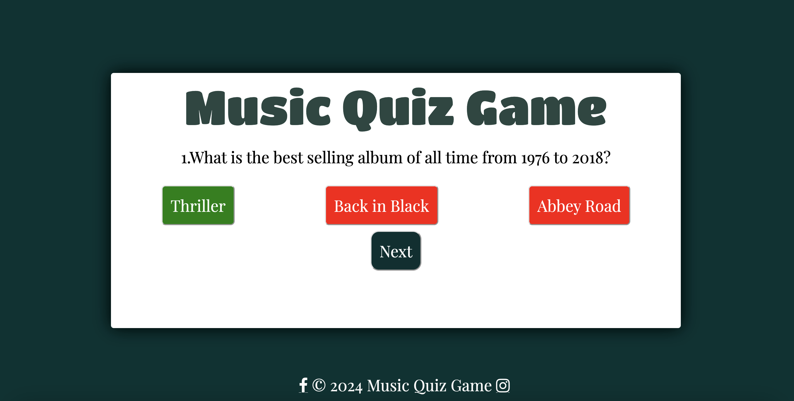
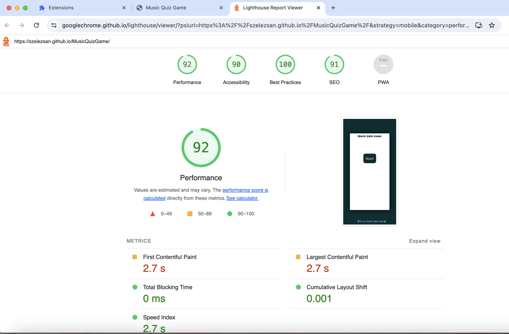
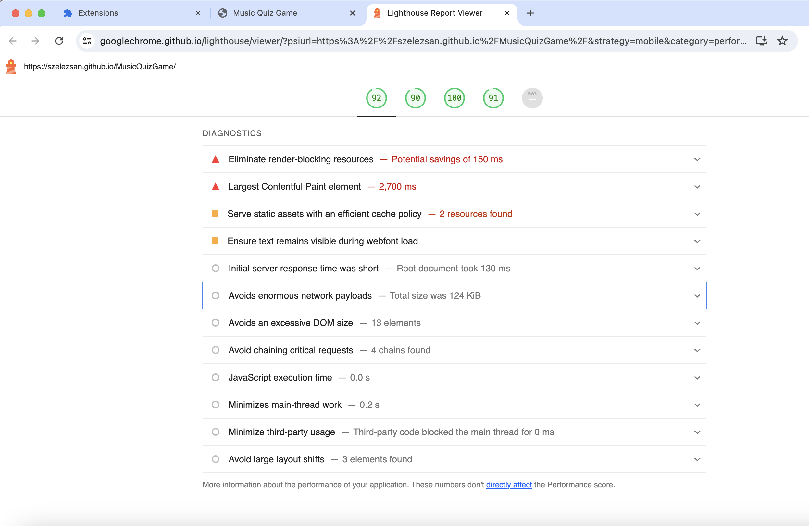
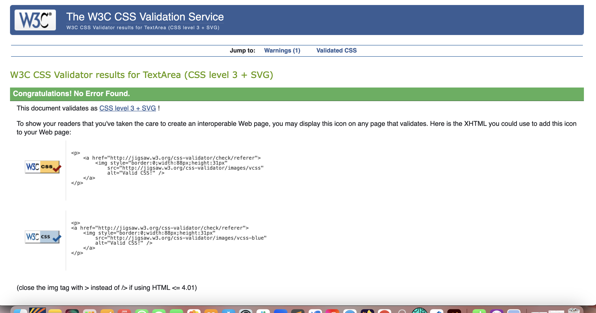
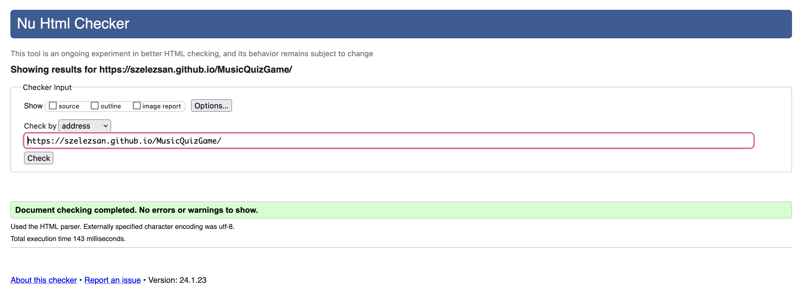

# MusicQuizGame

## Javascript Essentials

This is a simple browser-based trivia quiz game. There are a set of 10 music-related questions, with a set of 3 answers, but only one is correct.
The design is clear and simple, easy to navigate with the implemented start and next buttons.

The game is fully responsible for multiple devices.

## [View life website in GitHub pages](https://szelezsan.github.io/MusicQuizGame/)
---

# Table of contents

- [UX](#ux)
    - [Website owner goals](#website-owner-business-goals)
    - [User goals](#user-goals)
        - [New user goals](#new-user-goals)
        - [Returning user goals](#returning-user-goals)
        - [Website owner business goals](#website-owner-business-goals)
    - [User stories](#user-stories)
    - [Structure of the website](#structure-of-the-website)
    - [Wireframes](#wireframes)
    - [Surface](#surface)
- [Features](#features)
- [Technology](#technology)
- [Testing](#testing)
    - [Functionality testing](#functionality-testing)
    - [Compatibility testing](#compatibility-testing)
    - [Code Validation](#code-validation)
    - [User stories testing](#user-stories-testing)
    - [Issues found during site development](#issues-found-during-site-development)
    - [Performance testing](#performance-testing)
- [Deployment](#deployment)
- [Credits](#credits)
- [Screenshots](#screenshots)

# UX

## Website owner goals

This project was created for Code Institude's Full Stack Software Developer course/ Portfolio Project 2.
The Music Quiz Game presents 10 questions with 3 potential answers. For all questions, there is only one correct answer.

At the end of the game, the player's score will be visible.

## User goals

### New user goals:
- The game is an intermediate-level game, therefore it can be a little bit challenging for some people. This way the game is more interesting, and users won't be bored going through the quiz questions.
- Users can easily navigate throughout the game, with the clear, uniform design.
- The game provides feedback with a score message at the end of the game.

## User stories

### As a new customer:
* I wish to provide an entertaining game.
* I would the user to have an excellent user experience, and an easy-to-use surface.
* I would like the users to be given the chance to get all questions right. At the end of the game, they can start over the Music Quiz Game.

### As a returning customer:

* If users are unhappy with their quiz score, they can start the quiz again for better results.
* The uniform platform provides returning customers and easy navigation and excellent user experience.

## Structure of the website

The Music Game Quiz's main page includes a header and a start button for easy navigation.

The next pages have uniform layouts: A header, a question and 3 answers are displayed.

When the user clicks on any answer, it will provide instant feedback: if the answer is correct, the button turns green, if wrong button turns red. Also after clicking on any answer button the "Next button" will appear, and users can move on to the next question.

## Wireframes

I used website wireframe.cc to create wireframes.

## Surface

### Colors
Main colours used in a project:
* background color, header color:  --hue-neutral: 900;
* font color:  rgb(0, 0, 0);
* wrong answer color: --hue-wrong: 0;
* correct answer color: --hue-correct: 145;
* answer/start/next button font color:  rgb(255, 255, 255);

### Fonts 

* Body font: 'Franklin Gothic Medium', 'Arial Narrow', Arial, sans-serif;
* Header font: 'Titan One', sans-serif;

### Images

* No images were used in the project.

[Back to Table of contents](#table-of-contents)
___
# Features

The page has good contrast between colours for easy readability, and all navigation buttons are straightforward.

The website has below features:

## Start button

* Start button is located in the middle of the container.

## Next Button

* The Next button only appears visible, when an answer has been chosen. This button provides an option to go ahead to the next question and carry on with the game.

## Answer buttons

* During the quiz the user is provided with 3 answers, one correct and two incorrect ones. When any of the answer buttons are clicked the 'Next' button will show.

## Header

* The header with the name of the quiz(Music Quiz Game) is always presented and visible.

## Questions

* Each time a question is answered the 'Next' button shows and sets the next question.
There is a set of 10 questions altogether. Each time the 'Next button is clicked a new set of questions is displayed.

##  Future implementations

* Instruction page
* Adding sound when answers are chosen
* Add more questions\answeres.

[Back to Table of contents](#table-of-contents)
___
# Technologies used

### HTML5
* As a structured language.

### CSS
* As a style language.

### Font Awesome
* As an icon library for social links.

### Google fonts
* As a font resource.

### GitHub
* As a software hosting platform to keep projects in a remote location.

### Git
* As a version-control system tracking.

### Gitpod/VsCode
* As a development hosting platform.

### Wireframe.cc
* As a wireframing tool.

[Back to Table of contents](#table-of-contents)

___
# Testing

## Functionality testing 

 I used Mozilla web developer tools throughout the project for testing and solving problems with responsiveness and style issues.

## Compatibility testing
 The site was tested across multiple virtual mobile devices and browsers. I checked all supported devices in both Mozilla web developer tools and Chrome developer tools. 
 
 I tested on hardware devices such as Macbook Air 13", iPad, iPhone 11Pro, and Samsung Galaxy S23 ultra.

---
## Issues found during site development

* #### All answer buttons are active at all times.

While testing the game I came across a bug, which allowed the user to choose all answers and, therefore reach maximum points every time.
I was trying to solve many different ways to disable the button, but either the game stopped working, or all buttons were disabled, and the user could not click on them.

So I reached out to tutor support and Rebecca helped me out to sort the issue.

* #### Next button

I adjusted the height of the div for the answer buttons, so the Next button is not being pushed out of the container.

## Performance testing

I run [Lighthouse](https://developers.google.com/web/tools/lighthouse/) tool to check the performance of the website. Screenshots are presented below:

## Code Validation
when I finished my project I validated my code on the following websites:
 
 * [W3C CSS Validator](https://jigsaw.w3.org/css-validator/) to validate CSS

readmephotos/Validator/2cssvalidator.png

 * [Nu Html Checker](https://validator.w3.org/) to test HTML

 

 * [Jshintvalidator](https://jshint.com/)

[Back to Table of contents](#table-of-contents)

___
# Deployment

The project was deployed on GitHub Pages. I used Gitpod/VScode as a development environment where I committed all changes to the git version control system.
I used the push command in Gitpod to save changes into GitHub.

To deploy a project I had to:

* Log in to GitHub and click on repository to deploy.
* Select `Settings` and find the GitHub Pages section at the very bottom of the page
* From source select `none` and then `main` branch.
* Click `save` and the page was deployed after auto-refresh.
>  Your site is published at https://szelezsan.github.io/MusicQuizGame/

[Back to Table of contents](#table-of-contents)
___
# Credits

### README template:

https://github.com/marcin-kli/MP1/blob/Milestone-Projects/README.md

* Ideas and knowledge library:

    * [w3schools.com](https://www.w3schools.com)

    * [css-tricks.com](https://css-tricks.com/)

    * [getbootstrap.com/docs](https://getbootstrap.com/docs/4.5/getting-started/introduction/)
        I used code for the navbar, jumbotron and card from Bootstrap.

### Code

* Links transition: [CSS transition Property](https://www.w3schools.com/cssref/css3_pr_transition.asp)
* Stackoverflow: [Stack overflow](https://stackoverflow.com/)
* Tutor help: Rebecca from Tutor Help helped me with my answer button disabling and fixing an error from the browser.

### Grammar check

* Grammarly: [Grammarly](https://app.grammarly.com/ddocs/1860249529)

### Content:
*  Answer-question content:  [opentdb](https://opentdb.com/api_config.php)

[Back to Table of contents](#table-of-contents)
